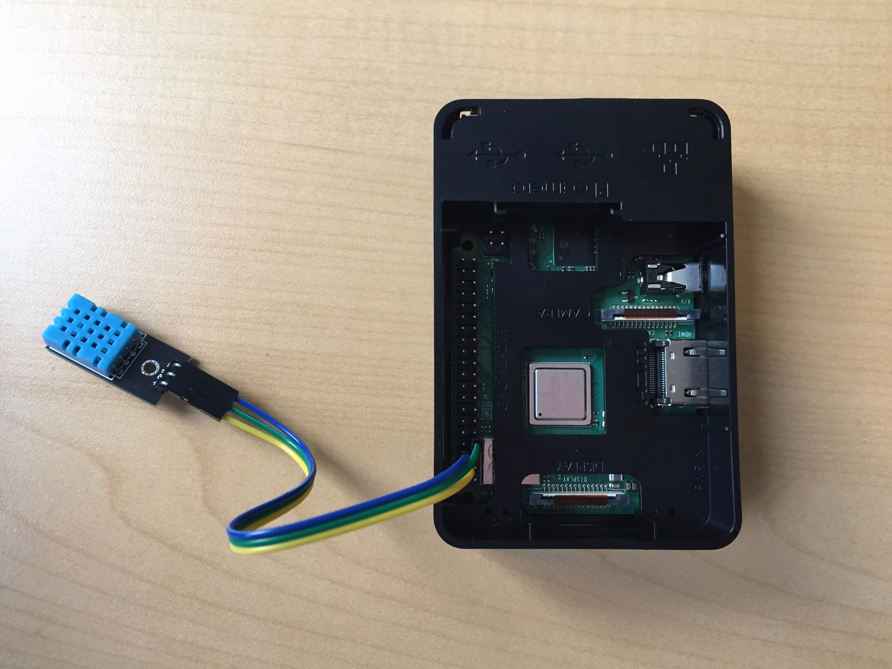

# raspi-dht11
Connecting a Raspberry PI to a DHT11 Temperature Sensor

<p  align="center">
    
</p>

## Setup
- connect PI to DHT11 (refer to articles below for details)
- Install python Library for the DHT11 sensor
```
sudo pip3 install Adafruit_DHT
```
- edit dht11.py, insert following code
```
vi dht11.py
```
```
import Adafruit_DHT
import time
 
DHT_SENSOR = Adafruit_DHT.DHT11
DHT_PIN = 4
 
while True:
    humidity, temperature = Adafruit_DHT.read(DHT_SENSOR, DHT_PIN)
    if humidity is not None and temperature is not None:
        print("Temp={0:0.1f}C Humidity={1:0.1f}%".format(temperature, humidity))
    else:
        print("Sensor failure. Check wiring.");
    time.sleep(3);
```
- execute
```
python3 dht11.py
```
- should see similar to the following (expect occasional failure):
```
Temp=23.0C Humdity=29.0%
Sensor failure. Check wiring.
Temp=23.0C Humdity=29.0%
Temp=23.0C Humdity=29.0%
```

## Sources
- https://www.thegeekpub.com/236867/using-the-dht11-temperature-sensor-with-the-raspberry-pi/
- https://learn.adafruit.com/dht-humidity-sensing-on-raspberry-pi-with-gdocs-logging/python-setup

## Related
- https://github.com/jimareed/azure-iot-raspi